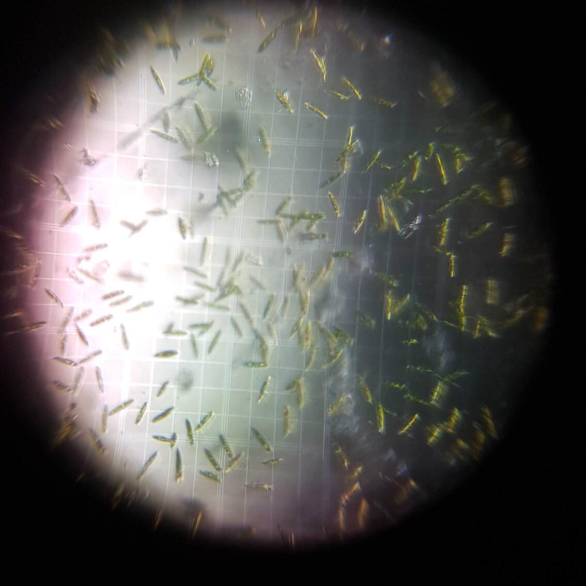

#  Lab From A Chip
Programme of Making and Doing Session at [EASST4SPRAGUE2020](https://www.easst4s2020prague.org/)

## Abstract

We ask questions as we build little logical maps together with *Euglena gracilis*; why are diodes so cheap, how do worms die? What organisms should we play with and how do old 7-inch vinyl records, Printed Circuit Boards (PCB's), Integrated circuits (IC's) A.K.A. silicon chips and other surplus domestic artefacts provide physical spaces to tell stories and learn critical knowledge? We explore this through 'kit culture', hands-on by using a prototype 'educational' kit and the emerging method of 'Interleaving Practices', part of artist-researcher Ross Dalziel's art-science practice and PhD research embedded in Lancaster University.

## Brief Description

Remote hands on making & doing session, featuring paper folding microscopy and micro-fluidics, so called 'lab-on-a-chip' technology. Materials will be provided as a kit posted to `EASST4SPRAGUE2020` participants who sign up to the activity prior to the online conference. Participants in their homes or safe spaces, will be led remotely by the artist-presenter-researcher on a screen sharing video platform in a making and doing session with these kits at `EASST4SPRAGUE2020`.

 Our new worlds of locating and timing is an opportunity to warp the time of the activity we normally get to engage with each other at our EASST meetings; the 'educational kit' format the session uses allows us to do this; some of the activity needs 1 or 2 days preparation and experiment prior to the activity, so the session will require some commitment to playing with materials to get the most out of it.

 We'd like to focus on all of our experiences with the kit so we see this as an experimental and informal show and tell more than a presentation online. Numbers are limited to available kits so we have a core group of engaged people.

We'll provide more information to participants who sign up with respect to online presentation dates and timings soon. We'll also include further information on the PhD research behind the session with an opportunity to engage further and health and safety information with respect to the packing and preparation of the kits.

We also welcome ongoing engagement and hope we can start some kind of collective and engage further with all of our research practices.

The project homepage provides updated further information and guidance

[cheapjack.github.io/LabFromAChip/](https://cheapjack.github.io/LabFromAChip/)

## Methods

It's a playful DIY approach to kit making, a key feature of Ross' work and his collaborators at [Domestic Science](https://domesticscience.org.uk/) and [DoESLiverpool](https://doesliverpool.com/). These kits are emerging, messy and unfinished; they 'bag up' & include existing kits, primarily the [Foldscope](https://www.foldscope.com/) and are at once a kind of literature review, fan-non-fiction and remix; your interactions will inform their future story. Once you receive your kit you will be able to use model organisms and surplus integrated circuits (IC's) included, the black boxes of microbiology and computer science. We'll learn how to make DIY micro-fluidic moulds, following the practices observed in Ross' research developed by researchers and teaching staff in the Division of Biomedical and Life Sciences (BLS) at Lancaster University.

For us science studies is a theoretical repertoire for a form of 'critical making', implosions & configuration methods (Ratto, Haraway, Dumit, Suchman) developed in an art practice embedded in microbiological pedagogy, the teaching space of BLS Lancaster and makerspace culture. The repertoire helps us 'unbox' an "infinity of traces" where the convenient mobilities of PCBs, biotech and interspecies gaming become not-so-humble-bundles of love, education, mobility, identity and inequality.

This helps inform, 'Interleaving practices' the artist-researchers emerging method for working with people in the diverse disciplines and domains of biomedical technoscience using the format of what we think of as 'kit culture', a mix of so-called STEAM education and makerspace culture. From here we negotiate the "World to chip barrier" (Longwell, Scott A, and Fordyce, Polly M. 2019. *micrIO: an open-source autosampler and fraction collector for automated microfluidic input–output London Royal Society of Chemistry*) where the 'revolutionary' promise of 'Lab-On-A-Chip' technology often becomes "A-Chip-In-A-Lab" (Ibid.). Kits here are boundary objects to support ongoing, troubling and messy explorations of biopolitics and cross species value extraction and a chance to see how much of this can be carried along in a kit format.

Participants having received their kits will use included [Foldscopes](https://www.foldscope.com/) with their smartphones and other included DIY lab materials to make non-toxic Polydimethylsiloxane (PDMS) silicon moulds from surplus 555 timer chips and the grooves of a fragment of a 7 inch vinyl record from a long gone Lovers Rock record label. Together, online and in our hands, we will try to play with, yet fail to care-for-fully, Euglena gracilis a heterotrophic protist algae, as hungry and motile as an animal, yet as resilient as a photosynthesising plant.

## Relevance

The silicon chip is a substrate for knowledge and mobility, enabling both washing machines and big DNA data, Gutenberg style embodiments of knowledge and punitive discipline, shaped by specific historical material arrangements. Data colonialism, public imaginaries and commons work upon it and through it. The who, how, why and where of making and maintaining them, matters. They are a political cut in the world, a revolutionary space, yet the masters tools for the master's house. We follow the hyperbole and reality of Lab On A Chip bio-tech to try to develop hybrid forums to re-configure these devices, the geographies they make and the crises they work in.

Ultimately we explore how much of this can be carried along in a cheap easy to distribute kit of materials and what ways of knowing it can be part of.

## Thematic Clusters

Experiments in Collaboration and Critical Participation
Multispecies Assemblages, Life Sciences, Queer Ecologies

## Other Thematic Cluster

Material activism, Kit making culture

## Technical Information

Online video platform information will be provided.
[Included](https://cheapjack.github.io/LabFromAChip/#included)

## Project URL

[cheapjack.github.com/LabFromAChip](https://cheapjack.github.com/LabFromAChip)

## Author
(Presenter-Artist-Researcher)
<a href="mailto:email@example.com?subject=Lab From A Chip at EASST4SPRAGUE2020">Ross Dalziel</a> 

## Getting Started

Already have your kit? checkout the [Getting Started guide](https://cheapjack.github.io/LabFromAChip/GettingStarted)
