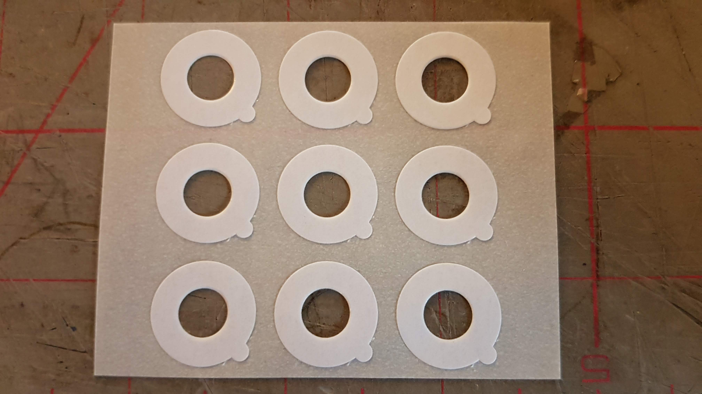
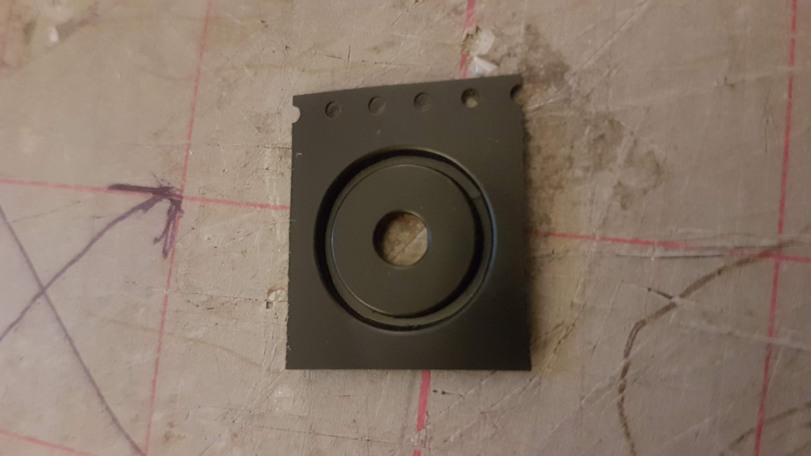
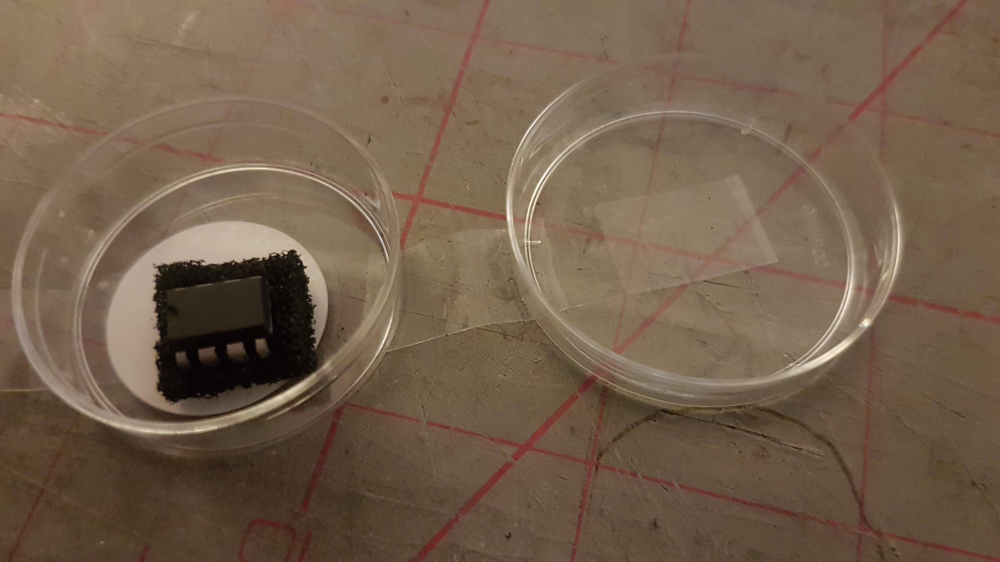
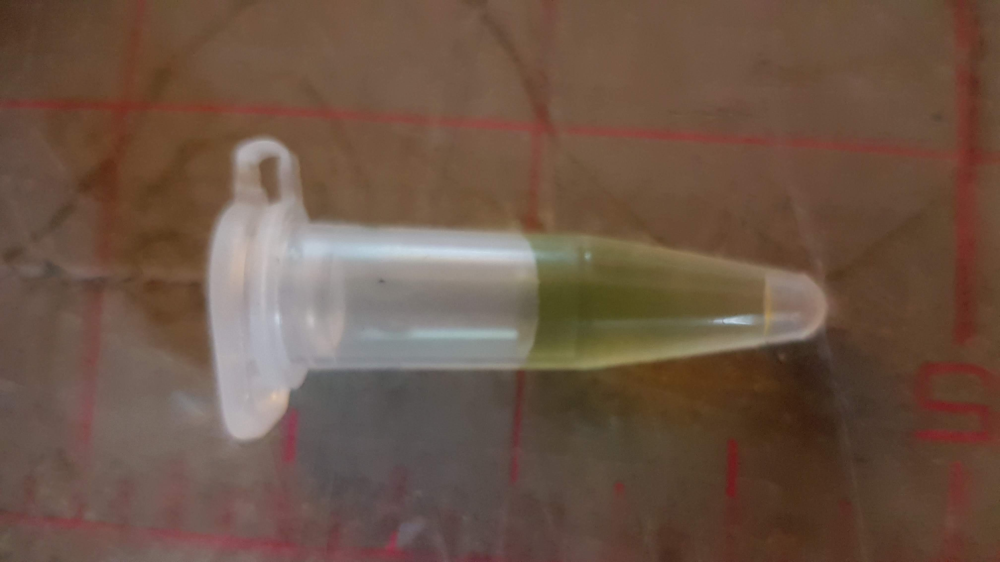
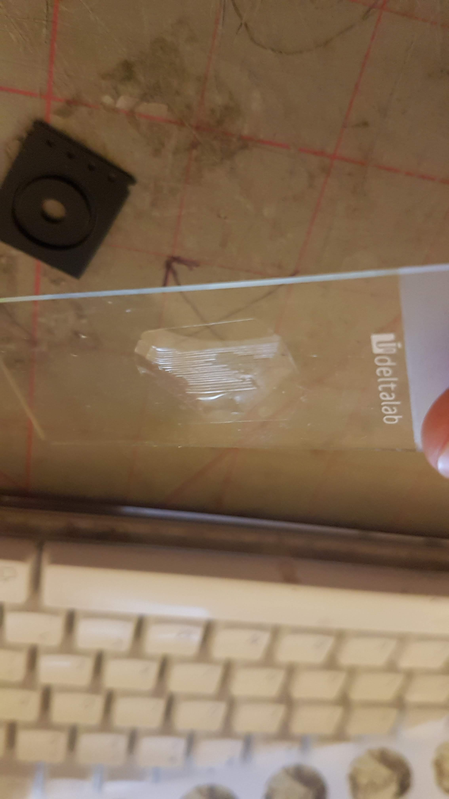
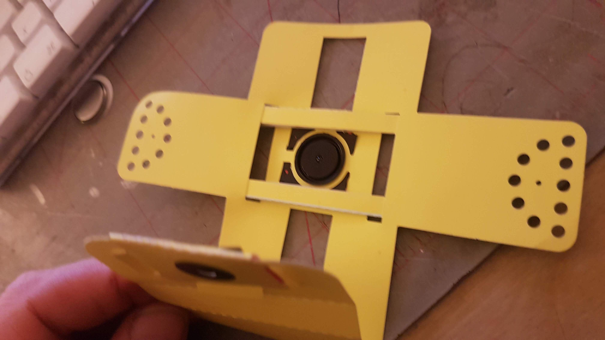
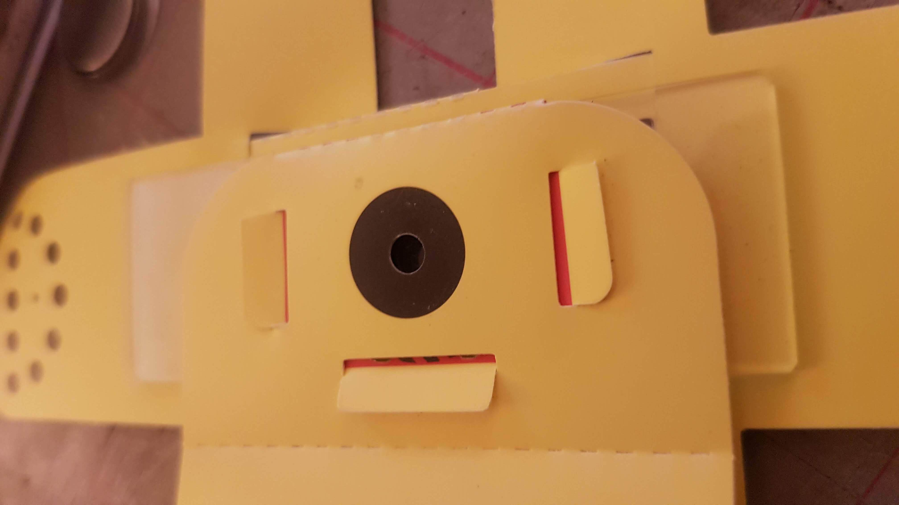
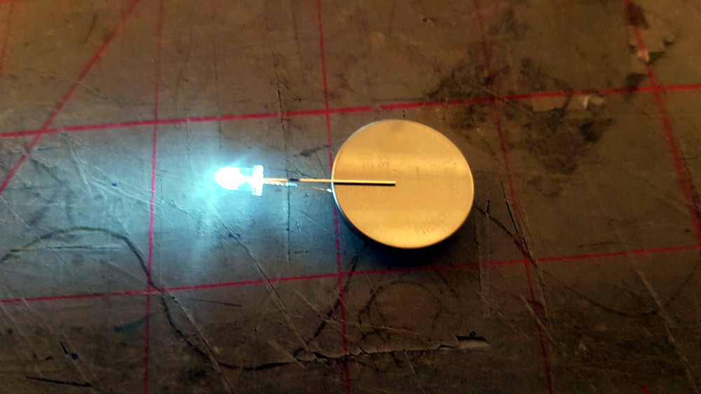

## Getting started

### Make A PDMS Mould

-   Get a small blob of `A` PDMS in cover of the petri dish (the shallow
    side)
-   Get a small blob of `B` PDMS in cover of the petri dish
-   Mix together with edge of a paper slide from the foldscope net.
-   Dip the `555` timer chip gently top first into the mix. Remove
    excess.
-   Brush some PDMS mix onto the vinyl record
-   Leave to dry
-   Cover the `555` timer with the deeper side of the dish to avoid
    dust.

### Quick Foldscope Assembly 🔬

We are going to do a quick build of a
[Foldscope](https://www.foldscope.com/) Prakesh Labs ingenious bit of
microengineering for frugal science.

1.  Open up your foldscope kit and open the instructions. We are going
    to just build the lens stage and focus ramp, a minimal build to look
    at some algae and make moulds and connect to our phone cameras.
    Steps 1 - 6, and step 10. of the **ASSEMBLY INSTRUCTIONS**
    1.  Insert coupler into Lens stage
    2.  Insert another coupler into the reverse of the stage
    3.  Fold and lock the bottom flap
    4.  Insert lens into the Lens stage.
    5.  Fold the Focus ramp
    6.  Insert ramp into stage
    7.  Fold the bottom of the Lens stage.

#### Connect to phone. 🤳 📷

Refer to **Phone View** in **VIEWING** section overleaf.

1.  Take the round white double sided peel off sticker and stick it
    carefully over your phone camera lens, make sure you dont get the
    glue on the lens. It comes off with water if you do :smile:

2.  Remove the white cover. Now theres a sticky side facing up.

3.  Take the other coupler and place it silver side down over the lens.
    Keep the lens central to the couplers hole.

#### Slide prep 🐛 

1.  Carefully with tweezers peel off the cured PDMS from your `555`
    timer chip in the petri-dish and place it so where it came into
    contact with the surface is flat on the surface of the slide, in the
    centre of the glass with the slide logo ledgible

2.  Take a micropipette and place the long tip from your kit on the end.
3.  Press and hold the button/plunger.

4.  Get a friend to open and hold the 1.5ml Eppendorf tube with the
    algae suspension inside.
5.  Insert tip into the Eppendorf tube
6.  Release the plunger, it will have captured the number of micro
    litres indicated on the pipette of algae suspension
7.  place the tip by the side of the tiny section of silicon.
8.  Press the button to eject the algae suspension, it should find it's
    way under the PDMS slab by capillary action
9.  Peel off the clear sticky cover slip and place over the slab. If
    your slab is too thick, dont bother. 

#### Viewing 👀

1.  Open & hold the rear flap, so the yellow side of the stage faces up
2.  Take your prepared slide and place cover slip or slab down over the
    tiny bubble of the ball lens.

3.  Let the bottom lens stage flap magnetically snap to hold the slide
    in place.
4.  Carefully turn over keeping slide in place. Use stickers if it
    slips. The blue side should face up
5.  Slide the focus ramp out so the `Z` mark on the stage lines up with
    the `0` on the focus ramp rule.
6.  Place on the desk with silver of coupler facing up
7.  Turn on your phone camera and slowly approach the coupler, the
    magnetic force whould make the stage jump up onto your phone.
8.  Watch and explore! Check your mould is in place, experiment with the
    focus and move around toward the light. Face a window or light or
    use the LED & Battery

